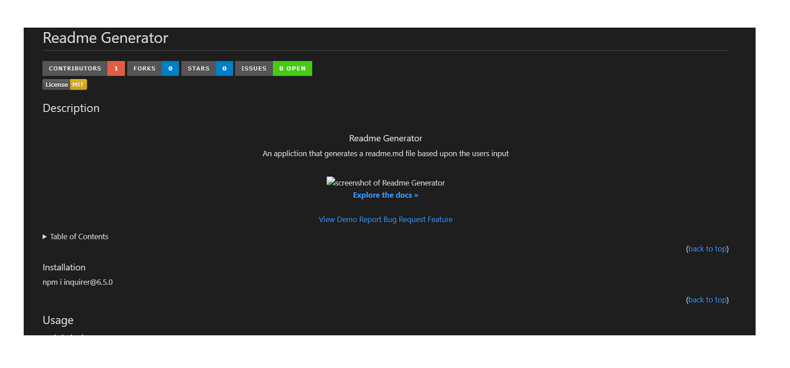

## Readme Generator

  

  [![Contributors][contributors-shield]][contributors-url]
  [![Forks][forks-shield]][forks-url]
  [![Stargazers][stars-shield]][stars-url]
  [![Issues][issues-shield]][issues-url]
   
  
   
   
  <!-- DESCRIPTION -->
  ## Description
  
  

    <h3 align="center">Readme Generator</h3>
    
An application that generates a readme.md file based upon the users input

     
    
<a href="https://drive.google.com/file/d/13uheiuIZNLZUPE_yFzbgO2Kl_ssFuNhT/view?usp=share_link">Video Demonstration</a>
    

       
      
       
      <a href="https://github.com/splwdev/readme-generator"><strong>Explore the docs »</strong></a>
       
       
      <a href="https://github.com/splwdev/readme-generator">View Demo</a>&nbsp;&nbsp;
      <a href="https://github.com/splwdev/readme-generator/issues">Report Bug</a>&nbsp;&nbsp;
      <a href="https://github.com/splwdev/readme-generator/issues">Request Feature</a>
    

  

  <!-- TABLE OF CONTENTS -->
  

    
Table of Contents

    <ol>
      <li><a href="#description">Description</a></li>
      <li><a href="#installation">Installation</a></li>
      <li><a href="#usage">Usage</a></li>
      <li><a href="#contributing">Contributing</a></li>
      <li><a href="#testing">Test Instructions</a></li>
      <li><a href="#license">License</a></li>
      <li><a href="#questions">Questions</a></li>
    </ol>
  

   
   

  <!-- INSTALLATION -->
  ### Installation
  
To get the ball rolling, you'll need to run the following command:

  <ul>
    <li>npm i inquirer@6.5.0</li>
  </ul>
   
   

  <!-- USAGE -->
  ## Usage
  
To use this application, please run the following command:

  <ul>
    <li>node index.js</li>
  </ul>
   
   

  <!-- CONTRIBUTION GUIDELINES -->
  ## Contributing
  
Contributions are what make the open source community such an amazing place to learn, inspire, and create. Any contributions you make are greatly appreciated.

  
If you wish to contribute to this project, please feel free to: 

  <ul>
    <li>Fork the repo and create a pull request</li>
  </ul>
  
You can also simply open an issue with the tag "enhancement". Don't forget to give the project a star! Thanks again!

   
   

  <!-- TESTING INSTRUCTIONS -->
  ## Testing
  
If you wish to test this application before running it, you can do so with the following command:

  <ul>
    <li>npm test</li>
  </ul>
   
   

  <!-- LICENSE -->
  ## License
  
Distributed under the Creative Commons Zero v1.0 Universal License.

   
   

  <!-- QUESTIONS -->
  ## Questions
  
If you have any questions, please contact me at splwebdev@gmail.com

   
  
You can also review the rest of my repository <a href="https://github.com/splwdev">here</a>

  [contributors-shield]: https://img.shields.io/github/contributors/splwdev/readme-generator.svg?style=for-the-badge
  [contributors-url]: https://github.com/splwdev/readme-generator/graphs/contributors
  [forks-shield]: https://img.shields.io/github/forks/splwdev/readme-generator.svg?style=for-the-badge
  [forks-url]: https://github.com/splwdev/readme-generator/network/members
  [stars-shield]: https://img.shields.io/github/stars/splwdev/readme-generator.svg?style=for-the-badge
  [stars-url]: https://github.com/splwdev/readme-generator/stargazers
  [issues-shield]: https://img.shields.io/github/issues/splwdev/readme-generator.svg?style=for-the-badge
  [issues-url]: https://github.com/splwdev/readme-generator/issues
  [product-screenshot]: ./assets/images/screenshot 
 
